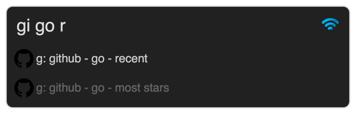

    

# Alfred Web Searches  
> [Alfred](https://www.alfredapp.com/) workflow to search through any website on the web (easily extendable list)

This workflow similar to [DuckDuckGo Bangs](https://duckduckgo.com/bang?) allows you to fuzzy search through a selection of websites that you can add and contribute to in [here](https://github.com/nikitavoloboev/alfred-web-searches/blob/master/workflow/websites.csv).

You simply search for the website you want to scope your search too, press enter and make your search.

Each search has a prefix to signify the theme or scope of the search. For example results prefixed with `r: ` will search through subreddits. Here is the full list of prefixes and their descriptions.

|  Prefix |  Decription |
|---|---|
|  r: | Search subreddits on Reddit  |
|  d: | Search documentation websites |
|  g: | Search GitHub |
|  s: | Search stack exchange sites |
| f:  | Search forums |
| t:  | Search Google Translate |
| w:  | Search ordinary websites (none of the above) |

Each prefix also has a corresponding icon for visual feedback of prefix meaning. 

And since the workflow allows for fuzzy searching, you can even make searches like that: 

And they will match.

You can also attach a hotkey that will take the selected text and then will let you search for that text on any of the websites.

## Install
Download the workflow from [GitHub releases](https://github.com/nikitavoloboev/alfred-web-searches/releases/latest).

## Contributing
If you use and like this workflow, you can add your own websites that you think are missing to the CSV file [here](https://github.com/nikitavoloboev/alfred-web-searches/blob/master/workflow/websites.csv). 

It has a simple structure of argument, followed by comma and then what website is going to be searched. Where the query you are searching for is replaced with `tester`.

## Thank you 💜
You can support what I do on [Patreon](https://www.patreon.com/nikitavoloboev) or look [into other repositories](https://my.mindnode.com/ZKGETDkUaQUsL3q8q9z788CxG84oEHgDiT79GuzX#-143.5,-902.6,0) I shared. 

## License
MIT © [Nikita Voloboev](https://www.nikitavoloboev.xyz)